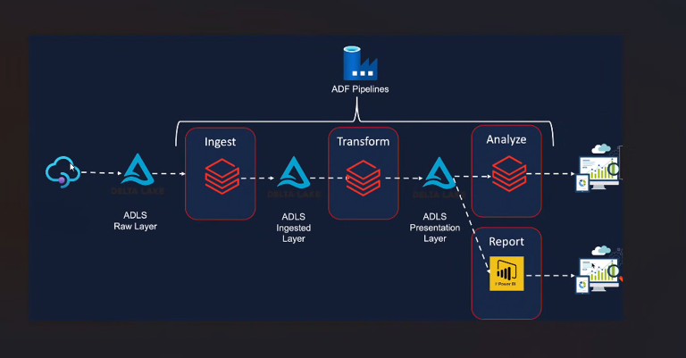

# NASA Near Earth Objects Azure Analytics Pipeline

A fully automated, cloud data pipeline to ingest and analyze Near Eart Objects (NEO) data provided by NASA's API. The project utilizes an end-to-end cloud pipeline using Azure Data Factory, ADLS Gen 2 and Azure Databricks.

## Architecture

The system follows a modular "Medallion" architecture to ensure data quality.

1. Ingestion : Azure Data Factory (ADF) automates a data fetch daily using dynamic expressions, fetching the latest data from the API.

2. Storage : The Raw JSON data and processed silver/gold data are stored in containers using ADLS Gen 2.

3. Transformation : Azure Databricks is used for data cleaning, schema validation and other processing for standard analysis.

4. Analytics : Processed data is stored as Delta Lake Tables and served through PowerBI using DirectQuery.

## Techstack

- Python
- Azure Data Factory
- Azure Data Lake Storage Gen 2
- Azure Databricks

## Local Emulation (`/local`)

This is a local emulation of the data ingestion and transformation pipeline. The processed data is stored as a parquet table for analysis and PowerBI. The necessary steps are detailed in the readme.

## Azure Deployment (`/azure_ready`)

This folder contains the necessary files and steps needed for deployment on Azure. This sets up an automated pipeline to fetch, ingest and process data through ADF and output as delta tables. PowerBI dashboard can also be connected to this.
